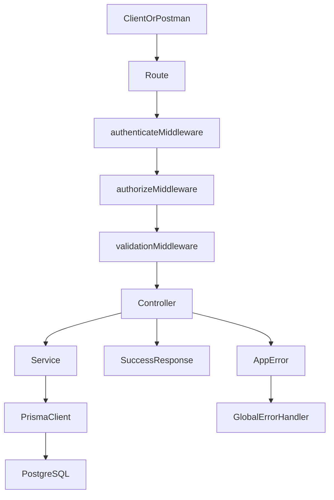

# Architecture and Data Flow

## High-Level Structure

- `routes/`: endpoint mapping + middleware chain
- `controllers/`: request handling + response formatting
- `services/`: business logic + Prisma data access
- `middleware/`: authentication, authorization, validation
- `utils/`: error and response helpers
- `prisma/`: schema and migrations

## Request Flow

## Data Model Summary

### `User`
- `id`, `name`, `email`, `password`
- `role`: `ADMIN | ANALYST | VIEWER`
- `status`: active/inactive
- relation: one-to-many with transactions

### `Transaction`
- `id`, `amount`, `type`, `category`
- `description`, `date`
- `createdBy`, `isDeleted`

## Role Behavior

- `VIEWER`: read transactions + summary only
- `ANALYST`: read transactions + summary only
- `ADMIN`: full access to users and transactions

## Design Tradeoffs

- Simple middleware-driven RBAC to keep access rules explicit.
- Service layer handles business logic and Prisma interaction.
- Soft delete chosen for safer transaction removal and auditability.
